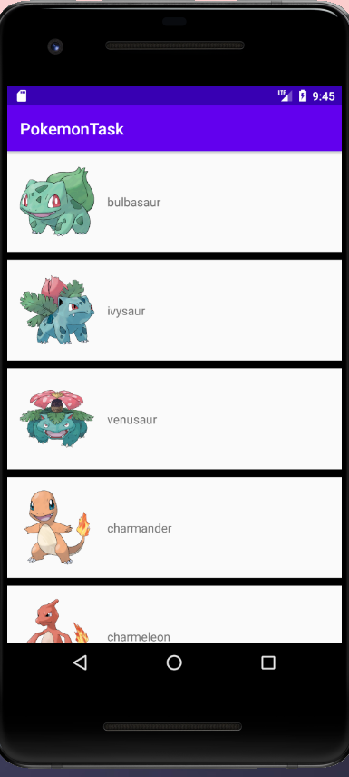

# PokemonTaskInKotlin
* Sample task on Pokemon api inspired by [Coding with nerds](https://www.youtube.com/channel/UCnDAXfhnL5j-KhHc1KhvXHw)

## Coverd Topics :
* MVVM
* LifeCycleAware Component
* DataBinding
* Instrumental Testing
* Room
* Retrofit
* Moshi
* Dagger hilt for di
* RecyclerView with DiffUtil
* Single Source of truth 
* Coroutines and Coroutines Flows 
* [MVI VERSION](https://github.com/ahmedsamir9/PokemonTaskInKotlin/tree/Mvi)
## ScreenShoot :

